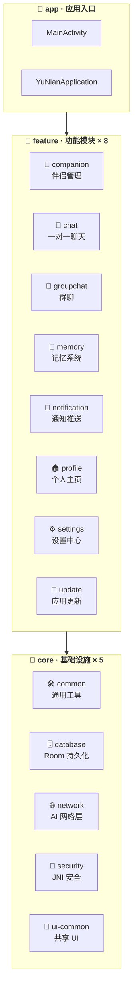

<p align="center">
  <picture>
    
  </picture>
</p>

<h1 align="center">💕 予念 · YuNian</h1>

<p align="center">
  <i>你的 AI 虚拟女友 — 随时随地，懂你陪伴</i>
</p>

<p align="center">
  <a href="https://developer.android.com"></a>
  <a href="https://kotlinlang.org"></a>
  <a href="https://developer.android.com/compose"></a>
  <a href="#"></a>
  <a href="#"></a>
  <a href="#"></a>
</p>

---

## ✨ 特色功能

<table>
  <tr>
    <td width="50%">
      <h3>🎭 AI 伴侣定制</h3>
      <p>自定义名字、年龄、性格、背景故事、说话风格 — 创造独一无二的她</p>
    </td>
    <td width="50%">
      <h3>💬 智能对话</h3>
      <p>多 AI 提供商支持、上下文感知、情感理解，让聊天自然流畅</p>
    </td>
  </tr>
  <tr>
    <td>
      <h3>🧠 记忆系统</h3>
      <p>AI 记住你的故事与偏好，越聊越懂你，建立真正的长期关系</p>
    </td>
    <td>
      <h3>👥 群聊互动</h3>
      <p>创建群组，与多位 AI 伴侣同时交流，体验丰富的社交场景</p>
    </td>
  </tr>
  <tr>
    <td>
      <h3>🎨 液态玻璃 UI</h3>
      <p>微信风格暗色主题 + 自定义液态玻璃特效，视觉冲击力拉满</p>
    </td>
    <td>
      <h3>🔐 原生安全</h3>
      <p>JNI / NDK 层签名校验、防调试、MITM 检测，守护应用完整性</p>
    </td>
  </tr>
  <tr>
    <td>
      <h3>🌐 多语言</h3>
      <p>简体中文 / 繁體中文 / English / 日本語 / 한국어 — 五语随心切换</p>
    </td>
    <td>
      <h3>⚡ 自动更新</h3>
      <p>基于 GitHub Release 的应用内更新，一键安装最新版本</p>
    </td>
  </tr>
</table>

---

## 🏗️ 模块化架构



> **14 个 Gradle 模块** · 5 层 core 基础 + 8 层 feature 功能 + 1 个 app 聚合入口 — 高内聚，低耦合

---

## 🧱 模块详解

### 🔵 Core 基础层

| 模块 | 职责 | 关键特性 |
|------|------|----------|
| `core:common` | 通用工具与基础服务 | 内容过滤、电池优化、帧率管理、硬件信息、图像工具 |
| `core:database` | Room 持久化层 | 7 张实体表、6 个 DAO、7 个 Repository、版本迁移至 v6 |
| `core:network` | AI 网络通信 | OpenAI / DeepSeek / Claude / Gemini / DashScope 多后端 |
| `core:security` | JNI 原生安全 | 签名校验、防调试检测、MITM 检测、GitHub 配置隐藏 |
| `core:ui-common` | 共享 UI 组件 | 液态玻璃、毛玻璃导航、骨架屏、弹性动画、聊天气泡 |

### 🟢 Feature 功能层

| 模块 | 职责 | 依赖 |
|------|------|------|
| `feature:companion` | 伴侣创建/编辑/列表 | database · ui-common · common |
| `feature:chat` | 一对一 AI 对话 | database · network · ui-common · profile |
| `feature:groupchat` | 多伴侣群聊 | database · network · ui-common · profile |
| `feature:memory` | 记忆管理与浏览 | database · ui-common · companion |
| `feature:notification` | 后台消息推送 | database · network · common |
| `feature:profile` | 首页/个人中心/协议 | database · ui-common · common |
| `feature:settings` | 主题/语言/帧率/更新 | database · ui-common · update |
| `feature:update` | 自动检查/下载/安装 | security · ui-common · common |

---

## 📦 项目结构

```
YuNian/
├── app/                              # 📱 应用入口（聚合所有模块）
│   ├── src/main/
│   │   ├── java/…/MainActivity.kt     # 主 Activity + 底部导航
│   │   ├── java/…/YuNianApplication.kt # Application 初始化
│   │   └── AndroidManifest.xml
│   └── build.gradle.kts
│
├── core/                             # 🧱 核心基础设施（5 模块）
│   ├── common/                       #    通用工具 · 内容过滤 · 帧率管理
│   ├── database/                     #    Room 数据库 · Repository · DAO
│   ├── network/                      #    Retrofit · AI 多后端适配
│   ├── security/                     #    JNI/NDK · liblianyu_security.so
│   └── ui-common/                    #    Compose 主题 · 液态玻璃 · 动画
│
├── feature/                          # 🎯 功能模块（8 模块）
│   ├── companion/                    #    AI 伴侣创建与管理
│   ├── chat/                         #    一对一聊天
│   ├── groupchat/                    #    群聊
│   ├── memory/                       #    记忆系统
│   ├── notification/                 #    后台推送 + 保活服务
│   ├── profile/                      #    首页 · 个人中心 · 协议
│   ├── settings/                     #    主题 · 语言 · 帧率
│   └── update/                       #    应用内自动更新
│
├── gradle/
│   └── libs.versions.toml            #  📋 统一版本目录
├── settings.gradle.kts
├── build.gradle.kts
└── README.md
```

---

## 🛠️ 技术栈

| 领域 | 技术 | 版本 |
|------|------|------|
| **语言** | Kotlin | 1.9.20 |
| **UI 框架** | Jetpack Compose + Material 3 | BOM 2024.10.01 |
| **数据库** | Room (Runtime + KTX + KSP) | 2.5.2 |
| **网络** | Retrofit + OkHttp | 2.11.0 / 4.12.0 |
| **序列化** | Kotlinx Serialization | 1.6.3 |
| **图片** | Coil Compose | 2.7.0 |
| **动画** | Lottie Compose + Compose Animation | 6.5.0 / 1.7.5 |
| **导航** | Navigation Compose | 2.8.0 |
| **安全** | NDK (ndkBuild) | 30.0.14904198 |
| **后台** | WorkManager | 2.9.0 |
| **更新** | Play App Update | 2.1.0 |
| **构建** | AGP + Gradle | 8.7.3 |
| **JDK** | Java 17 (JVM Toolchain) | 17 |

---

## 🚀 快速开始

### 环境要求

| 工具 | 最低版本 |
|------|----------|
| Android Studio | Hedgehog (2023.1.1) + |
| JDK | 17 |
| Android SDK | 35 (compileSdk) |
| NDK | 30.0.14904198 |
| Gradle | 8.7.3 |

### 构建

```bash
# 克隆
git clone https://github.com/linruoxi666/LianYu.git
cd YuNian

# Debug 构建
./gradlew assembleDebug

# Release 构建（需配置签名）
./gradlew assembleRelease
```

### 配置

1. 用 Android Studio 打开项目，等待 Gradle 同步
2. Release 构建需在根目录放置 `release.keystore`
3. 在 `settings.gradle.kts` 中已配置阿里云 Maven 镜像，加速国内依赖下载

---

## 👥 核心团队

<table>
  <tr>
    <td align="center">
      <a href="https://github.com/linruoxi666">
        
        <br />
        <sub><b>林梓涵</b></sub>
      </a>
      <br />
      <span>💻 🎨 创建者 & 全栈</span>
    </td>
    <td align="center">
      <a href="#">
        
        <br />
        <sub><b>下北泽传奇</b></sub>
      </a>
      <br />
      <span>🤝 核心协作者</span>
    </td>
    <td align="center">
      <a href="https://github.com/Vespera-Su">
        
        <br />
        <sub><b>祈愿小苏</b></sub>
      </a>
      <br />
      <span>🛡️ 安全加密 · 后端</span>
    </td>
  </tr>
  <tr>
    <td align="center">
      <a href="https://github.com/3092054815-byte">
        
        <br />
        <sub><b>着魔</b></sub>
      </a>
      <br />
      <span>💕📖 恋爱教程</span>
    </td>
    <td align="center">
      <a href="https://github.com/yuansi05">
        
        <br />
        <sub><b>鸢祀</b></sub>
      </a>
      <br />
      <span>🖼️🎙️ 多模态</span>
    </td>
    <td align="center">
      <a href="https://github.com/zzx511511">
        
        <br />
        <sub><b>故渊</b></sub>
      </a>
      <br />
      <span>🔧 后端支持</span>
    </td>
  </tr>
</table>

> 💡 欢迎提交 Issue 参与讨论，或提交 Pull Request 贡献代码！

---

## 📄 开源协议

本项目仅供学习交流使用。

---

<p align="center">
  <sub>Made with ❤️ by YuNian Team</sub>
</p>
